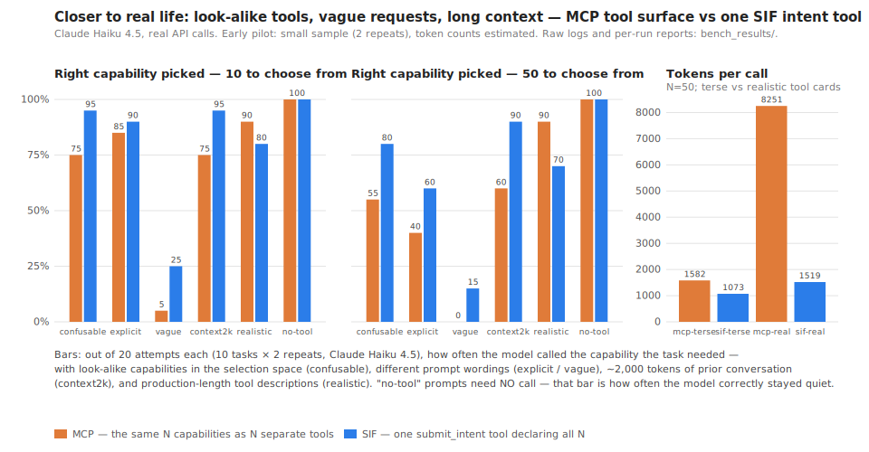

# bench_results — test data + harness for verifying the method

**Everything needed to check these results — the raw data of every model call, the
harness that produced them, and the scripts that aggregate and plot them — is in this
repository.** Nothing here asks to be trusted: recompute the matrix from the logs,
read the scoring code, or re-run the whole battery with your own key (docs/15 §5:
"someone at a gateway vendor can rerun it and be forced to accept the number").

The findings and their interpretation live in **docs/15 → "Pilot run record"** — this
directory is the evidence, not the narrative.



## Headline data — the realism battery (2026-07-02, Claude Haiku 4.5)

`2026-07-02-trackR-haiku-realism/` — six configurations at N ∈ {10, 50}, `mcp` vs
`sif`, 2 repetitions × 10 probes per cell, all with **confusable** (near-duplicate)
capabilities in the selection space unless noted:

| Folder | What it varies | One-line result |
|---|---|---|
| `confusable/` | look-alike capabilities, typical prompts | MCP 75/55 %, SIF 95/80 % correct (N=10/50) |
| `explicit/` | detailed prompt wording | hurts both at N=50 (wording collides with look-alike names); SIF still ahead |
| `vague/` | underspecified prompts | both mostly ask a clarifying question (~45–65 %) — scored as its own outcome, not failure |
| `distractor/` | prompts needing NO tool | **perfect on both surfaces** — zero over-calls; reported as the tie it is |
| `realistic/` | production-length tool cards | **MCP recovers to 90/90 % — an honest SIF loss on selection (80/70 %)** — but at 5.4× the tokens (8 251 vs 1 519 at N=50) |
| `context2k/` | ~2 000 tokens of prior conversation | MCP degrades (75/60 %), SIF barely moves (95/90 %) |

Every run folder carries the full output contract: `trials.jsonl` (one line per real
model call, including exactly what the model chose), `cells.json` / `cells.csv` (the
aggregated rates — the graphing input), `report.md` (rendered matrix), `meta.json`
(parameters + timestamps).

**These are PILOT runs**: one model, 2 repetitions per cell (the docs/15 §5 bar is
≥5), token counts are the ~4-chars/token estimate, and the retrieval-assisted
baseline was not run. Honest pilots, labelled as such — not the publishable
experiment.

## Interpreting the results — the reasoning, not just the numbers

Read every difference with the sample size in mind: 20 attempts per cell means a
10-point gap is two trials. The *patterns* below repeat across configurations; the
exact percentages do not deserve that trust yet.

- **`confusable` — why MCP falls and SIF holds.** With near-duplicate tools
  (`send_email` vs `dispatch_message`, overlapping one-line descriptions), MCP's
  discrimination signal is mostly the look-alike *names* — so wrong-tool picks
  appear (25% at N=50). SIF asks for a typed `resource.action` pair over enums,
  which keeps some structure (resource first, then action) — it degrades too (the
  pre-registered risk: the enum contains the same look-alikes) but much less. This
  is the folklore "tools are unreliable" reproduced under control: **confusability,
  not count, is the failure driver** (the superseded count pilot showed count alone
  does nothing).
- **`explicit` — why MORE detail hurt.** The explicit wordings use verbs like
  "*transfer* USD 800…" that literally match distractor names (`transfer_…`) —
  user word choice steering the model toward the wrong look-alike. Found by
  accident, kept because it is exactly how production misfires happen.
- **`vague` — why `clarify` is not failure.** On underspecified requests both
  surfaces mostly *ask a question* instead of acting (45–65%). For an agent that is
  arguably correct behaviour, so it is scored as its own outcome; among the
  attempts that DID commit, SIF committed correctly more often.
- **`distractor` — a clean tie.** Prompts needing no tool produced zero over-calls
  on either surface. Reported as the tie it is (docs/15 §6).
- **`realistic` — the most instructive row, and an honest SIF loss.** Production-
  length tool cards give each MCP tool a structured identity (usage paragraph +
  typed parameters); that per-tool signal disambiguates the look-alikes almost
  completely — MCP back to 90/90%. SIF received the *same information* (parity)
  but flattened into one long prose list inside its single tool description — and
  scored 80/70% with 15% clarify-hesitation. Same content, worse packaging: models
  are trained on discriminating separate structured tool cards; a prose wall is
  out-of-distribution. Two counterweights: MCP's fix costs **5.4× the tokens on
  every call** (8,251 vs 1,519 at N=50), and the bench flattening likely
  *under-sells* real SIF, whose generated schema carries the catalogue as
  structured `x-acp-actions` data, not prose. **Consequence recorded:** this row
  drives an open design item — rethink how the generated SIF surface presents its
  capability catalogue at scale (docs/03 → "SIF catalogue presentation at scale");
  this row is that redesign's acceptance test.
- **`context2k` — why SIF resists context load.** With ~2,000 tokens of prior
  conversation, MCP's fifty tool cards compete with the history for attention
  (75/60%); the single intent tool barely moves (95/90%).

## Superseded: the count-only pilot

`superseded-count-pilot/` — the first pilot (same day, earlier): tool COUNT alone at
N ∈ {10, 50, 100} with semantically distant fillers, three models (Haiku/Sonnet 5/
Opus 4.8). Its result — count alone does not break selection on current models;
tokens grow linearly for MCP (~3.1× gap at N=100) — motivated the realism battery
above, which is why it is superseded as the headline but kept in full (published
logs stay published; the `…-freestring-action/` subfolder is the evidence for the
formatting finding, docs/15 Amendment A1).

## Verify the harness before trusting a number

| What to check | Where |
|---|---|
| The two surfaces expose the same N capabilities, with the SAME descriptions (parity) | `src/acp_bench/tracks.py` (`mcp_surface`/`sif_surface`), `src/acp_bench/realism.py` (`realistic_mcp`/`realistic_sif`); asserted in `tests/test_bench_harness.py` |
| The confusable catalog (synonym verbs/resources, overlapping descriptions) | `src/acp_bench/realism.py` — `confusable_fillers` |
| The task set, phrasings, gold argument values, no-tool distractors | `reliability.PROBES`, `realism._PROMPTS` / `GOLD_VALUES` / `DISTRACTOR_PROMPTS` |
| The scoring rules (correct / wrong_tool / wrong_args / hallucinated / malformed / no_call / clarify / overcall) | `src/acp_bench/reliability.py` — `_score`, unit-tested |
| SIF is scored on picking the right `resource.action` PAIR — calling the single tool earns nothing | `_score`'s SIF branch; the `chose` column in every trials.jsonl |
| The deterministic 2k-token context prefix | `realism.build_context` + `_CONTEXT_TURNS` |
| Token numbers are an ESTIMATE (~4 chars/token) | `src/acp_bench/model.py` — `MeteredProvider` docstring |

Reproduce any cell (your own Anthropic key):

```
python -m acp_bench --track r --run --models small --reps 2 --ns 10,50 \
    --surfaces mcp,sif --fillers confusable [--phrasing vague] [--cards realistic] \
    [--context-tokens 2000] [--probe-set distractor] --out mydir
```

Recompute a matrix from a raw log without re-running: count outcomes per
(condition, n) over `trials.jsonl` — the aggregation is
`reliability.reliability_matrix`, ~25 lines. The graph regenerates from the CSVs via
`make_graph.py` (committed alongside).
