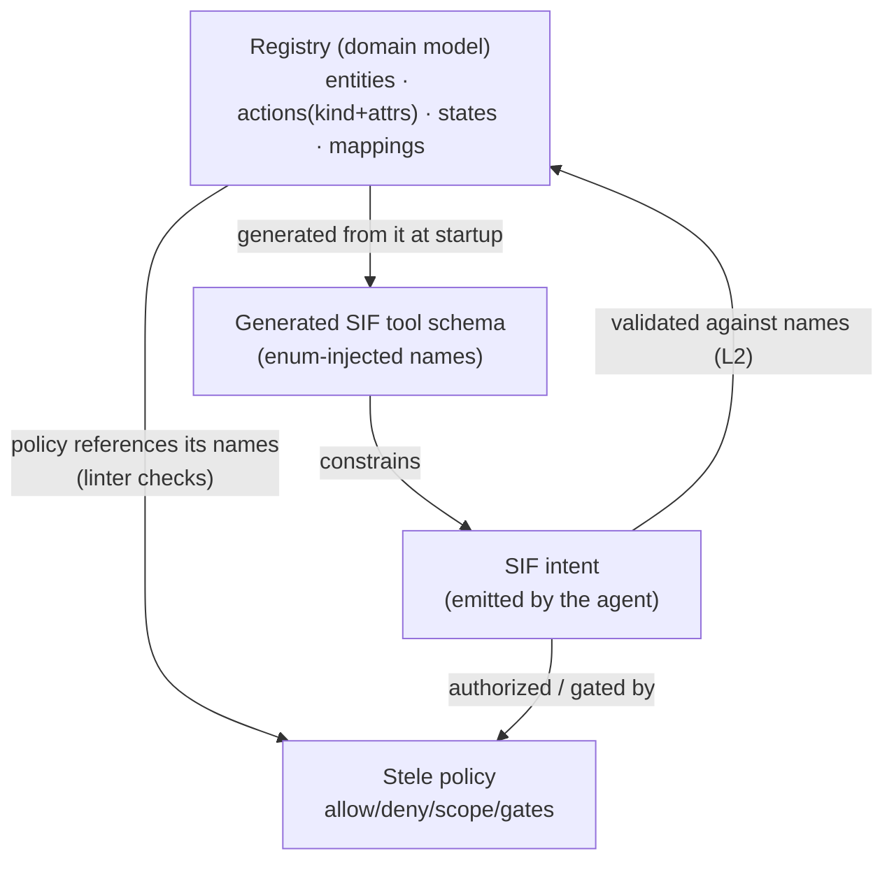

# Artifacts & Schemas — what they are, why separate, how they relate, how they're used

This document answers a question the rest of the spec assumes: **how many schemas are there, why are they separate, and how do they work together at runtime?** Short answer: **three artifacts, two schemas you author, and one SIF schema that is generated** (with a thin static SIF schema for shape-only checks).

---

## 1. The three artifacts (and who authors each)

The system has three distinct artifacts. The reason there is more than one comes down to **who writes it, how often it changes, and how much it is trusted.**

| Artifact | Authored by | Changes | Trust | Defines |
|---|---|---|---|---|
| **Registry** (domain model) — [`06`](06-registry-domain-model.md) | the **integrator / engineer** | rarely (stable) | trusted, reviewed | *the world:* entities, actions (kind + attributes), states, mappings |
| **Stele policy** ([`01`](01-RFC-agent-control-policy.md)) | the **security / policy officer** | often; **signed** | trusted, signed | *what's allowed:* allow/deny/scope/gates |
| **SIF intent** ([`00`](00-RFC-sif-intent-format.md)) | the **agent (LLM), at runtime** | every request | **untrusted** | *what's wanted:* one batch of typed operations |

These three are deliberately *not* one file, because they have opposite properties: the registry is stable and engineering-owned; the policy changes constantly and is security-owned (and signed); the intent is produced fresh every turn by the least-trusted component in the system. Collapsing them would force the most-trusted and least-trusted things to share a lifecycle and an owner — the opposite of what you want.

---

## 2. The schemas

| Schema | Validates | Static or generated? | When it runs |
|---|---|---|---|
| `schema/registry.schema.json` | a registry file | **static** (you author) | author time + load |
| `schema/stele.schema.json` | a policy file | **static** (you author) | author time + load |
| **SIF tool schema** | the agent's intent | **generated from the registry** | built at startup; used every request |
| `schema/sif.schema.json` | the intent's generic shape | **static, thin (L1 only)** | every request, before the generated check |

So: **two schemas you hand-maintain** (registry, Stele). **SIF's real validating schema is generated** — it is *not* a file you write, because it must contain *this domain's* names (`Patient`, `pay`, …) as enums, and those live in the registry. The static `sif.schema.json` checks only the generic shape (an `operations` array; each op has a valid `kind` and the right fields) — it cannot and does not know domain names.

---

## 3. Why SIF's schema is generated, not authored

This is the crux. SIF's defining safety property (SIF RFC §4) is **enum injection**: the agent can only name entities, actions, fields, and values the registry declares — invalid names are *unrepresentable*, not merely rejected. A *static* SIF schema could never enforce that, because at the time you'd write it you don't know the domain's names; it would either be too loose ("`entity` is any string") to provide the guarantee, or it would duplicate the registry and drift from it.

So the gateway **reads the registry at startup and generates the `submit_intent` tool schema** with the registry's names baked in as enums. That generated schema is what the agent is actually constrained by. Generating it from the single source of truth (the registry) means it can never disagree with the domain — and when the registry changes, the agent's surface updates automatically, with no second file to edit.

---

## 4. How they relate

The **registry is the source of truth**; the other two derive from it.

In words: the **policy references** registry names (the linter rejects a policy that names something the registry doesn't declare). The **SIF tool schema is generated** from the registry. The **agent's intent** is shaped by the generated schema, checked for *names* against the registry (L2), and then *authorized* by the policy.

Dependency order to remember: **Registry → SIF (generated) → Stele (references).**

---

## 5. How they're used at runtime

**(a) Author / build time**
- Write the **registry**; validate against `registry.schema.json`.
- Write the **policy**; validate against `stele.schema.json`, then **lint against the registry** (every referenced name exists, `deny` included — you deny things that exist; Stele §13.1).
- Optionally **sign** the policy (+ registry bundle) so the gateway will only run approved versions.

**(b) Startup / load**
- The gateway loads the registry and the policy (verifying the signature if signing is enabled).
- It **compiles the policy** into the authorization matcher.
- It **generates the SIF tool schema** from the registry (enum-injected) and hands it to the agent as the `submit_intent` tool.

**(c) Per request** — for each intent the agent emits, in order:
1. **L1 — shape.** Validate against the generic `sif.schema.json` (well-formed operations).
2. **L2 — names/values.** Validate against the **registry** (entities/actions/fields/enums exist). *(The generated tool schema already prevents most violations; L2 is the authoritative re-check below the model.)*
3. **Authorize.** Stele `allow`/`deny` decision.
4. **Scope.** Inject the actor's scope (below the model).
5. **Gates.** Run Stele gates (limits, approvals, etc.).
6. **Kill check → execute → record.** (Pipeline per the implementation design.)

Steps 1–2 are "is this *valid* SIF for this domain?" (registry + SIF). Steps 3–5 are "is it *allowed*?" (Stele). That clean split — **valid vs. allowed** — is exactly why the schemas are separate.

**Policy signing (status: seam, deferred — this paragraph is its single home).** Where signing is enabled, the gateway verifies a signature over the **bundle** — the policy, the registry, and the registered-function set (docs/06 §6.3) — at load; a verification failure means the policy does not load (fail closed, like any load-time validation failure). Key management, signature format, and the approval workflow are deployment tooling, deliberately unspecified in this draft. Until a mechanism is specified, "signed" elsewhere in these docs means "went through your organisation's review-and-approve process, pinned in version control."

---

## 6. Summary

- **Three artifacts:** registry (the world), policy (what's allowed), intent (what's wanted) — separated by author, cadence, and trust.
- **Two static schemas you author:** `registry.schema.json`, `stele.schema.json`.
- **One generated schema:** the SIF tool schema, built from the registry at startup (this is what makes enum-injection real).
- **One thin static schema:** `sif.schema.json`, generic L1 shape-checking only.
- **The rule:** registry is the source of truth; SIF is generated from it; Stele references it. Validity (registry + SIF) is checked first, then permission (Stele).
