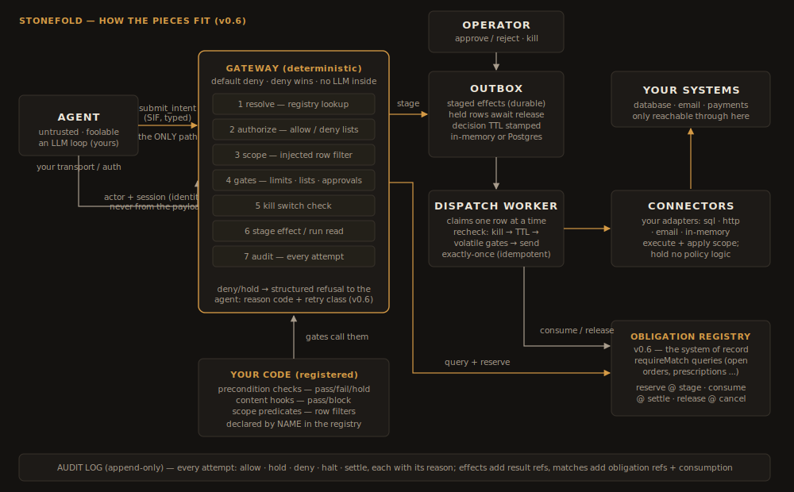

# The Stonefold developer's guide

*You cloned the repo. Now what?*

This guide takes you from an empty checkout to a running gateway with an
agent behind it, one runnable script at a time. Every script in this
directory is a complete program, executed by the test suite on every commit
(`tests/test_guide_examples.py`) — so what you read here is what actually
runs, and it cannot silently rot.




The one-sentence model, before any code: **the agent's only power is to
submit a typed intent; a deterministic gateway decides allow / hold / deny /
halt; effects are staged and dispatched by a worker so a human can still say
no; and every attempt — especially the refused ones — goes on the record.**

---

## Part 0 — Setup

What you need, and when:

| You want to… | You need |
|---|---|
| develop, run this guide, run the demo in fake-LLM mode | **Python 3.11+** only — everything below runs in-memory |
| run the real-LLM demo UI | Docker + an Anthropic (or OpenAI) API key |
| durable staging/audit (production-shaped) | Postgres (outbox + audit) and Redis (rate counters) — the repo's `docker compose up -d` provides both |

There is no PyPI package yet; you install from the checkout:

```bash
git clone --recurse-submodules https://github.com/stonefold-ai/stonefold
cd stonefold
python -m venv .venv && . .venv/bin/activate     # Windows: .venv\Scripts\activate
pip install -e ".[dev]"

pytest -q -m "not integration"    # verify: everything green, no Docker needed
```

The `spec/` directory is a git submodule (the canonical spec repo). If it is
empty, run `git submodule update --init`.

---

## Part 1 — Hello, gateway (`01_hello_gateway.py`)

```bash
python guide/01_hello_gateway.py
```

Three objects and one function call are the whole core:

1. **The registry** declares everything that *exists* — resources, their
   actions, and each action's kind (`observe` / `assess` / `record` /
   `effect` / `transition`). An undeclared action is not "forbidden"; it is
   **unsayable** — the gateway refuses it before any policy runs.
2. **The policy** (written in Stele) says what *this agent* may do. The
   gateway's ground state is **default deny**: with no policy, or for
   anything the policy doesn't list, the answer is no.
3. **`enforce()`** is the pipeline: resolve → authorize → scope → gates →
   kill → execute → audit. One call per attempted action, always ending in
   an audited decision.

The script shows the four decisions that define the model: default-deny with
no policy, allow after one `allow:` line, deny for a permission you didn't
grant, and deny for a name that doesn't exist.

Where things run: the **connector** is the adapter that actually touches the
system behind a resource (`InMemoryConnector` here; `SqlConnector`,
`HttpConnector`, `EmailConnector` ship in `stonefold_connectors`; you write
your own by satisfying the small `Connector` protocol). Connectors execute
and apply the injected scope — they hold **no policy logic**.

## Part 2 — Connect an agent (`02_connect_an_agent.py`)

```bash
python guide/02_connect_an_agent.py
```

An agent gets **exactly one tool**: `submit_intent`. Its JSON schema is
generated from your registry, so resource names are enums — a hallucinated
name fails the tool call's own schema before the gateway even answers. The
script runs a scripted "LLM" through the loop; a real deployment swaps in a
model's tool-use call and changes nothing else.

The rule that matters most: **identity comes from your transport, never from
the agent's payload.** `submit_intent` takes `actor`/`session` as call
parameters supplied by your authenticated transport; anything identity-shaped
the model writes into `data` is inert.

**The same thing over HTTP.** The repo ships a FastAPI app around the same
`Gateway` object:

```python
# serve_gateway.py — build the pieces exactly as in the scripts, then:
from stonefold_gateway.main import create_app
app = create_app(gateway, kill_service=kill_service, audit=audit, outbox=outbox)
# uvicorn serve_gateway:app --port 8099
```

```bash
curl http://localhost:8099/tool-schema         # hand this to your LLM
curl -X POST http://localhost:8099/submit_intent \
  -H "Content-Type: application/json" \
  -H "X-Actor-Id: rep-7" -H "X-Session-Id: s1" \
  -d '{"resource": "Ticket", "action": "create", "data": {"subject": "hi"}}'
```

Identity arrives in the `X-Actor-Id` / `X-Session-Id` headers (the built-in
provider trusts your transport's authentication; a credential verifier plugs
into the same `IdentityProvider` seam). The complete worked example of a
**real LLM loop** against this surface — inbox, prompts, provider
abstraction, web UI — is the AP demo: `src/stonefold_ap_demo/agent.py` and
`demo/` (see `docs/05-demo-spec.md`).

**Already have tools/MCP?** Keep them: `MCPProxy` in
`stonefold_gateway.transport` maps each existing tool call to a declared
action and enforces it; unmapped tools are denied.

## Part 3 — Registered functions: the code you write (`03_registered_functions.py`)

```bash
python guide/03_registered_functions.py
```

Built-in gates compare intent fields against constants. Your **domain
knowledge** enters through three kinds of small deterministic functions. The
registry declares their *names* (so the linter can hold policies to them);
you register the *implementations* on the gate engine:

| Kind | Signature | The gateway calls it… |
|---|---|---|
| scope predicate | actor → row filter | at every read, and as a pre-check on targeted effects — injected below the model |
| content hook | payload → pass/block | when a gated action carries `contentCheck:` |
| precondition check | `GateContext` → pass / fail / **hold** | at decision time, and again inside the dispatch claim (the world may have moved) |

House rules for all three: deterministic (no model calls), read facts from
**your** systems (never from the agent's payload), and signal a policy
verdict by *returning* — a raised exception means "my dependency is down",
which the gateway fails **closed** on your behalf.

The `hold` verdict (v0.6) is for judgment-shaped ambiguity: the data was read
fine, and the honest answer is "a human should look at this". A hold must
carry a machine-readable reason code, declared with a retry class in the
registry — the script shows the agent receiving `stock-uncertain / escalate`.

## Part 4 — The full machine (`04_the_full_machine.py`)

```bash
python guide/04_the_full_machine.py
```

Effects never fire inline. An allowed effect is **staged** in the outbox and
a **dispatch worker** sends it — which is what makes the human controls real:

- **Approval:** a `requireApproval` hold parks the row until someone with the
  named role releases it; rejection means it never dispatches.
- **Kill switch:** one call halts a session / agent / everything; staged rows
  are cancelled inside the dispatch claim, so there is no race to win.
- **Freshness:** every staged row carries a decision TTL, and the worker
  re-validates the volatile gates at dispatch — a decision is only trusted
  for a bounded time.
- **Exactly once:** every staged row carries an idempotency key; worker
  retries can never double-send.
- **Audit replay:** `audit.by_correlation("run-1")` returns the whole run as
  one ordered story.

For development the in-memory outbox is fine. For anything real, use the
Postgres outbox (`stonefold_store.outbox_pg.PostgresOutboxStore`) — its claim
is a real `SELECT … FOR UPDATE`, which is what makes the kill-versus-dispatch
race actually closed, and the Redis counter store for rate limits. That is
the entire infrastructure story: two containers, both optional until you
need durability.

## Part 5 — v0.6: obligation matching (`05_obligation_matching.py`)

```bash
python guide/05_obligation_matching.py
```

Everything so far bounds damage; none of it can catch the payment that is
under every limit and corresponds to **nothing** — no order was ever placed,
or the invoice is already paid. In bounds is not the same as owed
(`docs/18-obligation-checking-pattern.md`). v0.6 closes exactly this:

- **`obligationRegistries`** (registry): declare the system of record and the
  typed fields policies may compare — a match surface, not a domain model.
- **The adapter** (your code): four idempotent operations over the real
  ERP/EMR — `query`, `reserve`, `consume`, `release`. The in-memory reference
  (`InMemoryObligationRegistry`) ships with the repo.
- **`requireMatch`** (policy): the match rule lives in the policy file where
  reviewers and the linter can see it. Exactly one open record within
  declared tolerance passes; zero resolves `onNoMatch`; several resolve
  `onAmbiguous` — the gateway **never picks**.
- **The lifecycle**: the matched record is *reserved* when the action stages,
  *consumed* when it lands, *released* on any cancellation — one order line
  can never pay two invoices, even across the decide→dispatch gap.
- **The feedback channel**: every refusal carries a code and a retry class —
  `outside-tolerance / retryable` (fix the intent and resubmit), `no-match /
  terminal` (stop; nothing to fix), a hold (wait; a human owns it). An
  iterating agent converges instead of flailing, and duplicate holds collapse
  into one queue item with an attempt count.

Start simpler if you can: a plain precondition check that queries your ERP
gives the same protection with zero declarations (Part 3 + RFC §7.16's
adoption path). Reach for `requireMatch` when you want the rule in the
policy file, holds routed to a named resolver, or gateway-managed consumption
because your record system doesn't mark things spent.

---

## Where to go next

- **`docs/02-implementation-design.md`** — how the pipeline works inside.
- **`spec/docs/01-RFC-agent-control-policy.md`** — Stele, normatively: all
  fifteen gates, the condition language, the linter rules.
- **`spec/examples/*.stele.yaml`** — five worked policies (payments,
  clinical, legal, support, defence) that load and lint clean.
- **`docs/05-demo-spec.md` + `demo/`** — the full real-LLM demo with UI,
  approvals inbox, live trace, and kill switch.
- **`docs/12-conformance-tck.md`** — certify a gateway you wrote yourself,
  in any language, against the same spec.
